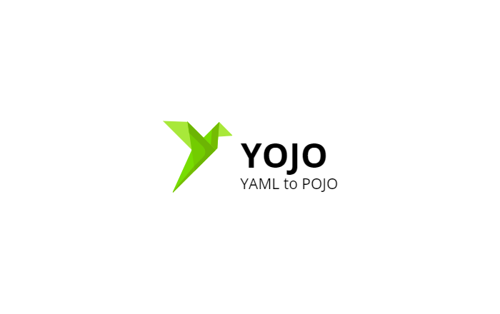

### YOJO
#### YAML to POJO generator 


Developed according to 📗 [Official documentation](https://www.asyncapi.com/docs/reference/specification/v2.6.0)

- 👉 [Description](#Description)
- 🎓 [Examples](#Examples)
- 🔥 [Releases](#Releases)
- 💻 [Developers](#Developers)

## Description
The generator works with schema objects described in `components:`

An excerpt from the 📜 AsyncApi documentation:

The AsyncAPI Schema Object is a JSON Schema vocabulary which extends JSON Schema Core and Validation vocabularies. 
As such, any keyword available for those vocabularies is by definition available in AsyncAPI, and will work the exact same way, including but not limited to:
1. [ ] `title`
2. [x] `type`
3. [x] `required`
4. [ ] `multipleOf`
5. [x] `maximum`
6. [ ] `exclusiveMaximum`
7. [x] `minimum`
8. [ ] `exclusiveMinimum`
9. [x] `maxLength`
10. [x] `minLength`
11. [x] `pattern` (This string SHOULD be a valid regular expression, according to the ECMA 262 regular expression dialect)
12. [ ] `maxItems`
13. [ ] `minItems`
14. [ ] `uniqueItems`
15. [ ] `maxProperties`
16. [ ] `minProperties`
17. [x] `enum`
18. [ ] `const`
19. [x] `examples`
20. [ ] `if` / `then` / `else`
21. [ ] `readOnly`
22. [ ] `writeOnly`
23. [x] `properties`
24. [ ] `patternProperties`
25. [x] `additionalProperties`
26. [ ] `additionalItems`
27. [x] `items`
28. [ ] `propertyNames`
29. [ ] `contains`
30. [x] `allOf`
31. [x] `oneOf`
32. [x] `anyOf`
33. [ ] `not`

The following properties are taken from the JSON Schema definition but their definitions were adjusted to the AsyncAPI Specification.

1. [x] `description` - CommonMark syntax can be used for rich text representation.
2. [x] `format` - See Data Type Formats for further details. While relying on JSON Schema's defined formats, the AsyncAPI Specification offers a few additional predefined formats.
3. [x] `default` - The default value represents what would be assumed by the consumer of the input as the value of the schema if one is not provided. Unlike JSON Schema, the value MUST conform to the defined type for the Schema Object defined at the same level. For example, of type is string, then default can be "foo" but cannot be 1.
4. [x] `$ref` - Alternatively, any time a Schema Object can be used, a Reference Object can be used in its place. This allows referencing definitions in place of defining them inline. It is appropriate to clarify that the $ref keyword MUST follow the behavior described by Reference Object instead of the one in JSON Schema definition.

**Not all keywords are currently available.
Available are marked with a checkbox.**

## Examples

See examples [here](./examples)

## Releases
### 💥 Release 0.0.x:
##### Currently implemented the following 📈 features:
* 📈 Support for the following keywords:
  * `type`
  * `format`
  * `example`
  * `description`
  * `$ref`
  * `required`
  * `maxLength`
  * `minLength`
  * `maximum`
  * `minimum`
  * `digits`
  * `pattern`
  * `name`
  * `title`
  * `summary`
  * `enum`
  * `x-enumNames`
  * `examples`
  * `properties`
  * `items`
  * `default`
  * `additionalProperties`
* 📈 Added the following annotations based on keywords:
  * `@NotNull`
  * `@NotEmpty`
  * `@NotBlank`
  * `@Size`
  * `@Pattern`
  * `@Valid`
* 📈 Added required imports according to annotations
* 📈 Filling JavaDoc based on keywords:
  * `description`
  * `example`
* 📈 Added getters and setters
* 📈 Added Lombok
  * If a lombok is selected, the following annotations will be annotated:
    * `@Data` 
    * `@NoArgsConstructor`
  * Added optionally annotations: 
  * However, you can control Accessor filling
    * `@AllArgsConstructor`
    * `@Accessors(fluent = true, chain = true)`
 * 📈 Added generating messages
    * Schema generates to "common" directory
    * Message generates to "messages" directory
* 📈 Added function to add extends of class.
  Example : 
  * `extends:`
    * `fromClass: SomeDTO`
    * `fromPackage: ru.example.path`
  More examples in allSupportedCases.yaml
* 📈 Added function to add implements of class.
  Example :
  ````
  implements:
    fromInterface:
      - ru.example.path.SomeInterface
More examples in allSupportedCases.yaml
* 📈 Added custom `bigDecimal` and `bigInteger` format
  * Added annotation `@Digits`
    ````* Example: 
      someCost:
        type: number
        description: The price of smth.
        format: bigDecimal
        digits: integer = 18, fraction = 2
* 📈 Added Logs to Console
* 📈 Unbound from apache lang dependencies
* 📈 Added support inner schemas
* 📈 Optimization code by abstract of variable properties
* 📈 Added support of generation `Enum` classes
* 📈 Added support of generation `Map<String, Object>` or other default types
* 📈 Added support of generation `Set<String>` or other default types
* 📈 Added support of validation groups. It was added for the specific cases, when you already have groups but want to use generator. Example: 
  * ````Example:
    Request:
      type: object
      description: SomeRequest
      validationGroups:
        - ApplicationValidation.Application.class
      validationGroupsImports:
        - ru.example.path.validation.ApplicationValidation
      validateByGroups:
        - fieldForValidation
        - fieldForValidation
        - fieldForValidation

* 📈 Added support of polymorphism for schemas
* 📈 Added support of polymorphism for messages from channels

See also to [here](./examples) to find more cases.

## Developers
* 😎 Vladimir Morozkin
  * 💬 Contacts:
    * 📧 Email: `jvmorozkin@gmail.com`
    * 📟 Telegram: `@vmorozkin`
